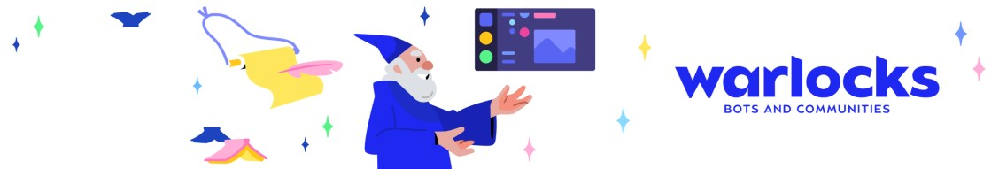
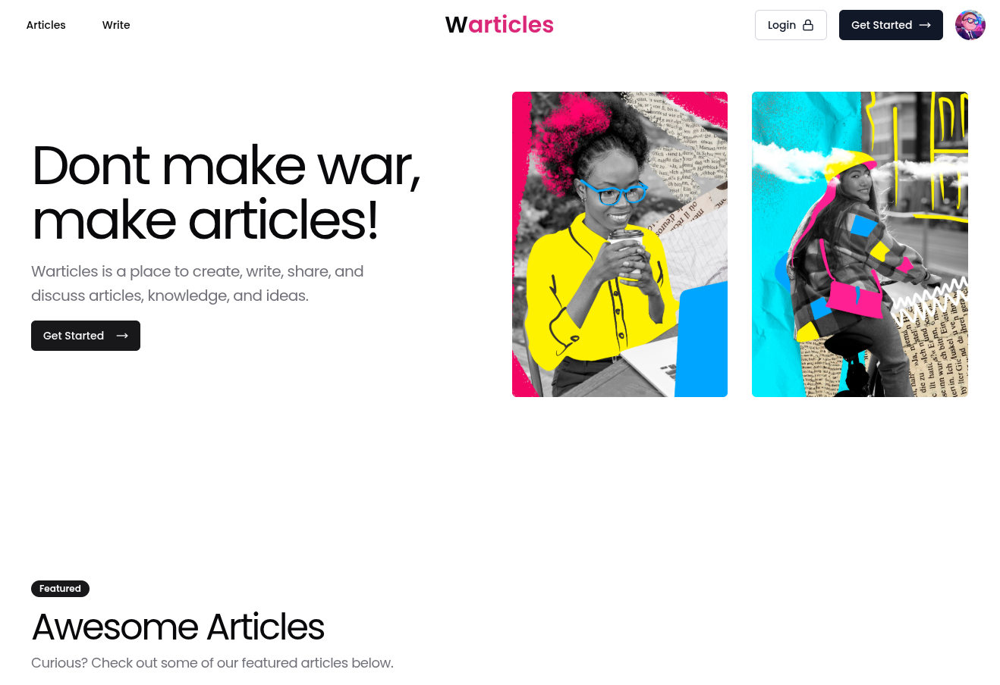
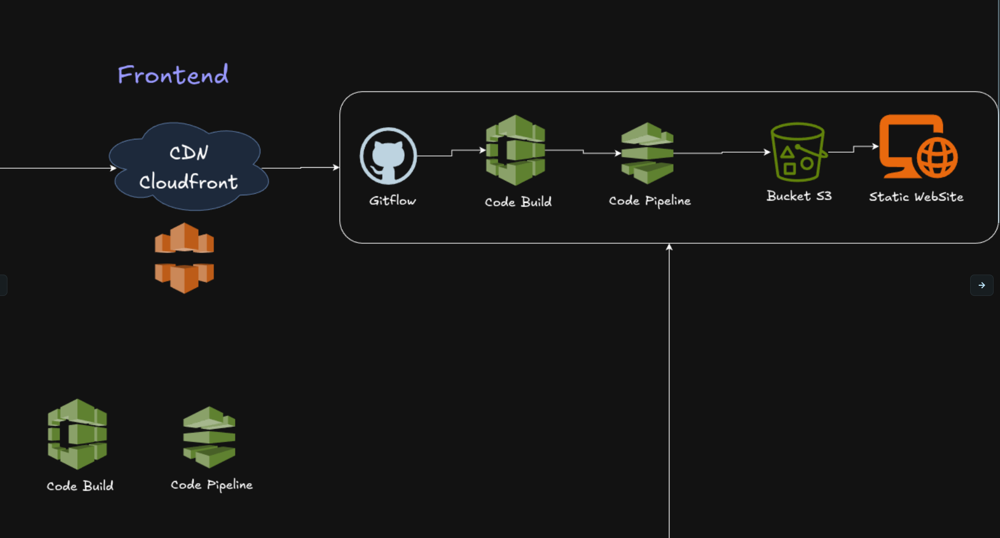

## Desafio Técnico: Plataforma de Artigos com Foco em Escalabilidade e Qualidade de Código



Este repositório foi criado para demonstração do frontend (Warticles) para o desafio técnico da Warlocks. Nele temos um protótipo básico de uma aplicação Next com um design system baseado nos componentes da biblioteca Shadcn e uma separação de componentes usando Atomic Design.




### Tecnologias usadas no backend

- [ ]  Next 15 com typescript
- [ ]  Shadcn
- [ ]  Tailwind CSS
- [ ]  Docker e docker-compose
- [ ]  Nginx como proxy reverso


### Metodologias

- [ ]  Atomic Design (Blocks e ui elements)
- [ ]  SOLID, componentes com responsabilidades bem definidas, interfaces para facilitar a troca de implementações, etc.
- [ ]  Gitflow customizado (development / prod), com branches para features e hotfixes. Nenhuma branch pode mergeada diretamente na main, deve passar por rigorosas revisões de código antes de ser aprovada.


## Como rodar localmente?

Você poderá testar o front-end neste endereço logo a baixo mas se quiser testar localmente, basta seguir os passos:

[http://warlocks.codestation.com.br](http://warlocks.codestation.com.br)

### O primeiro passo é clonar o projeto:

```bash
git clone git@github.com:mackson/warlocks-articles-frontend.git

```

### Segundo passo, acesse o repositório e configure seu .env baseado no .env.example

```bash

NEXT_PUBLIC_API_URL=http://localhost:5001
NEXT_PUBLIC_UNOPTIMIZED=true

```
## Atenção
Toda a aplicação está conteinerizada por tanto para testar localmente basta usar os seguintes comandos:
Obs: será necessário ter o docker e docker-compose instalados na sua máquina.


```bash
## Na primeira vez
docker-compose up --build -d

## Após o primeiro build
docker-compose up -d

## Para parar o container
docker-compose down

```

### Como experimentar a o frontend Localmente


Acesse o endereço: 
[http://localhost:5002](http://localhost:5002)


### Se desejar rodar sem o docker

```bash
npm run dev

# ou

yarn dev

```

## Infraestrutura, Arquitetura / System Design

Para hospedar o frontend optaria por usar a AWS, com uma combinação simples de S3, contendo o build do site estático, linkado com o Cloud Front (CDN) que vai cachear os assets e disponibilizar a aplicação no local mais próximo do usuário.




### TODO (O que eu faria com mais tempo)

- [ ]  TODO: Terraform para subir as infraestruturas de development e production
- [ ]  TODO: CI/CD com AWS CodePipeline e AWS CodeBuild + buildspec
- [ ]  TODO: Step de testes unitários no AWS CodeBuild e AWS CodePipeline
- [ ]  TODO: Husky para linting e commit hooks
- [ ]  TODO: AWS S3 para armazenamento de arquivos e site estático
- [ ]  TODO: Code review automatizado com SonarQube
- [ ]  TODO: Ambiente de dev e prod
- [ ]  TODO: Testes unitários dos componentes
- [ ]  TODO: Context API para gerenciamento de estado

## Infraestruturas alternativas

- Poderia usar também o AWS Amplify para hospedar o frontend.
- Outra alternativa mais barata seria usar um container docker com Nginx, como fiz para esse desafio.
